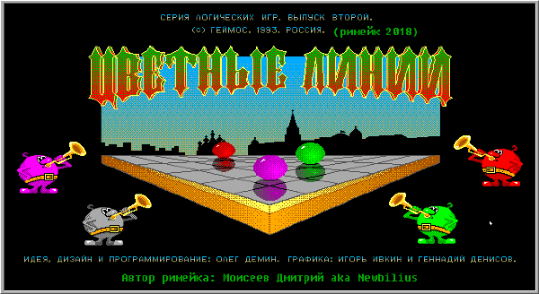
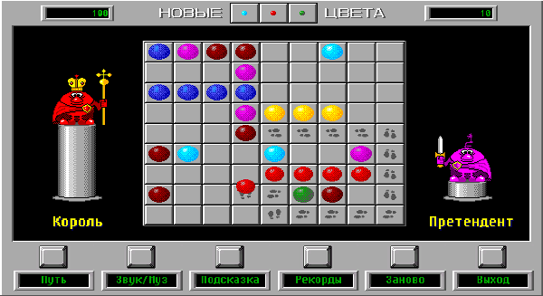

# Порт MS-DOS игры "цветные линии" на Unity

Игра, в которой нужно выстраивать линии из шариков одного цвета, по 5+ в ряд по горизонтали и вертикали.
Первый блин на Unity.

# Как поиграть

* [Скачать](https://github.com/Newbilius/ColorLinesUnity/releases) Windows-версию в релизах
* [Установить](https://play.google.com/store/apps/details?id=com.newbilius.lines) Android-версию из GooglePlay
* [Потыкать](http://www.old-hard.ru/color_lines_unity/) веб-версию на HTML5. В этой версии не работают звуки, хотя музыка играет нормально. Почему? Не разбирался :-/

# Оригинал на сайте Old-Games
https://www.old-games.ru/game/136.html

## О, ты разобрал формат ресурсов оригинала?
Нет! Я просто с помощью DosBox записал все звуковые эффекты и запринтскринил все кадры анимации всех объектов :D Благо DosBox умеет делать такие скриншоты без искажений или потерь в качестве.

## Потенциальные фичи и доделки, на которые я никогда не найду времени

* Сделать отдельную сцену для Android - текущая плохо подходит для телефонов из-за малого размера поля, хотя на планшетах играется нормально
* Реагировать на смену разрешения (сейчас разрешение можно выбрать только до старта)
* Хранить рекорды в облаке и шарить их между игроками
* Добавить модуль для сбора информации о крэшаках