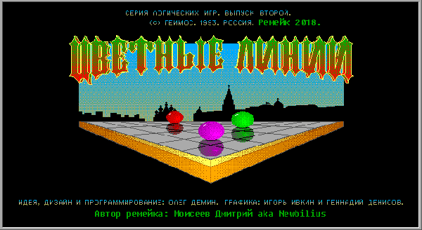

# Порт MS-DOS игры "цветные линии" на Unity

Игра, в которой нужно выстраивать линии из шариков одного цвета, по 5+ в ряд по горизонтали, вертикали или диагонали.
Первый блин на Unity.

# Как поиграть

* [Скачать](https://github.com/Newbilius/ColorLinesUnity/releases) Windows-версию в релизах
* [Установить](https://play.google.com/store/apps/details?id=com.newbilius.lines) Android-версию из Google Play. Хотя если у вас нет возможности что-то установить из Google Play - [в релизах](https://github.com/Newbilius/ColorLinesUnity/releases) есть и готовый APK файл
* [Потыкать](http://www.old-hard.ru/color_lines_unity/) веб-версию на HTML5. В этой версии не воспроизводится часть звуков, хотя музыка играет нормально. Почему? Не разбирался :-/

# Оригинал на сайте Old-Games
https://www.old-games.ru/game/136.html

## О, ты разобрал формат ресурсов оригинала?
Нет! Я просто с помощью DosBox записал все звуковые эффекты и запринтскринил все кадры анимации всех объектов :D Благо DosBox умеет делать такие скриншоты без искажений или потерь в качестве.

## Потенциальные фичи и известные проблемы, на которые я наверное никогда не найду времени

* Правильный рандом под конец игры, когда поле забито - работа сделана в ветке **better_end_random**, но есть сомнения по поводу производительности, так что я пока не влил правки в основную ветку
* Кастомный курсор - работа начата в ветке **custom_cursor**, но возникла проблема с сохранением размера относительно разрешения, пока не копал
* Правильные пропорции графики. Оригинальная MS-DOS игра рендерит картинку в разрешении 640x350, именно из него я и выдирал графику. Но блин, изначальная версия вышла в годы мониторов с соотношением сторон 4:3, и именно под него результирующая картинка и растягивалась. Я начал работать над проблемой в ветке **aspect_fix**, но мне не нравится результат, особенно если смотреть на мобилке, так что пока что правки в master не влил
* Сделать отдельную сцену для Android - текущая плохо подходит для телефонов из-за малого размера поля, хотя на планшетах играется нормально
* Реагировать на смену разрешения (сейчас разрешение можно выбрать только до старта)
* Хранить рекорды в облаке и шарить их между игроками
